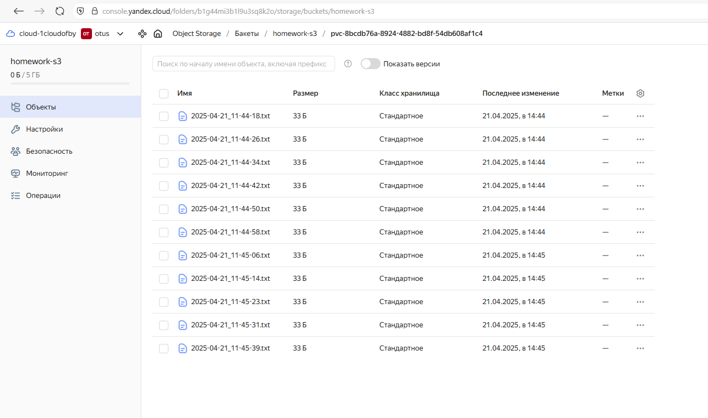
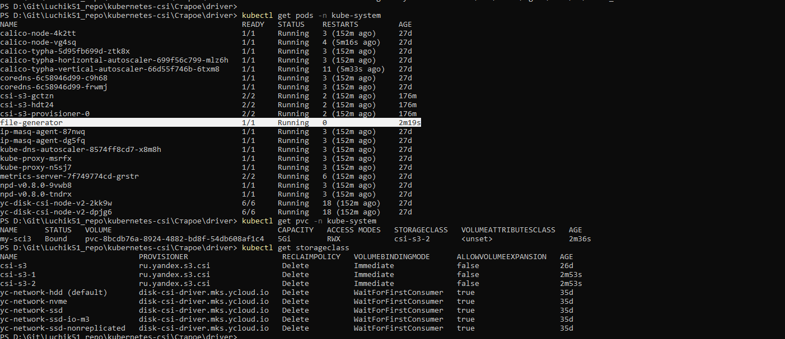
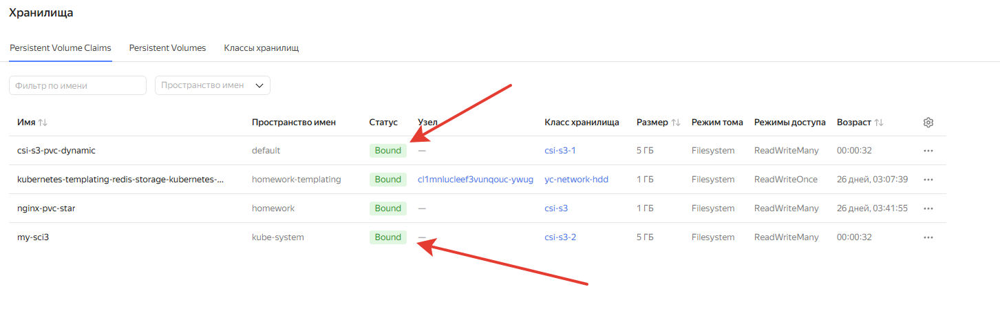
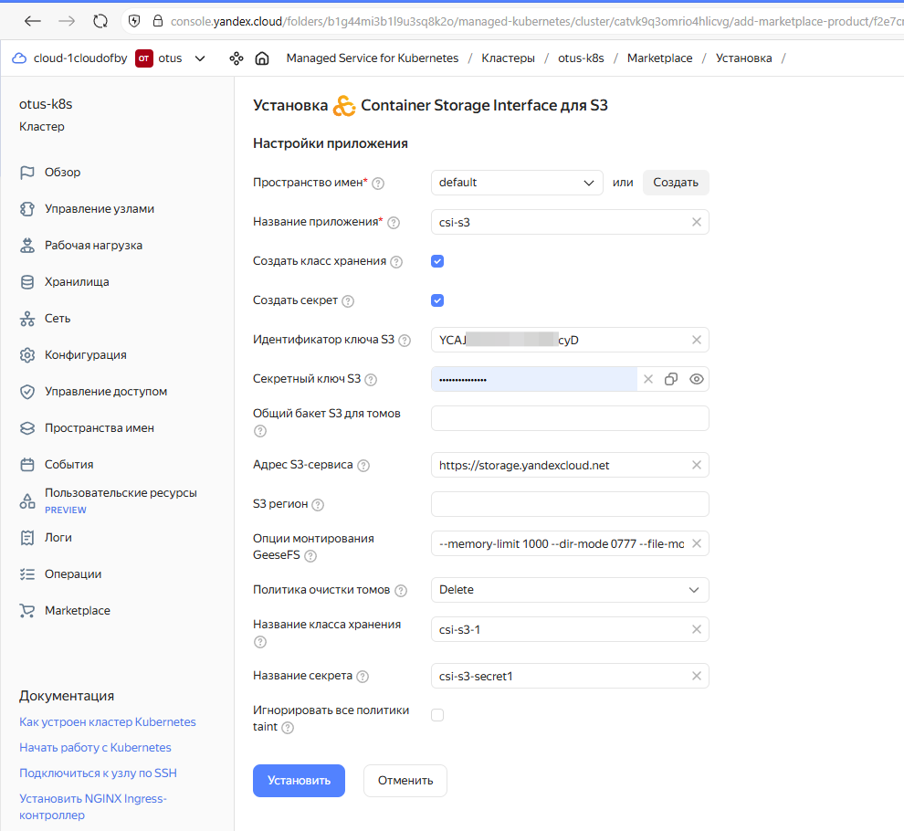

# Установка и использование CSI драйвера

## Домашнее задание  

1) Установить и сконфигурировать CSI driver для Yandex Object Storage
2) Запускать и исполþзовать полезную нагрузку, использовать для хранения бакета в Yandex Object Storage

## Действия:
**Предварительные обязательные действия:**  
Создайте сервисный аккаунт с ролью storage.editor.  
Создайте статический ключ доступа для сервисного аккаунта и сохранить его.  
Создайть бакет в Yandex Object Storage

Инструкция: https://yandex.cloud/ru/docs/managed-kubernetes/operations/applications/csi-s3  
Git: https://github.com/yandex-cloud/k8s-csi-s3  

**Вариант 1 - ручной**
Настраиваем все через манифесты: драйвер (для работы с S3) + StorageClass (для использования драйвера) + Secret (для доступа к S3) + pvc (для выделения места для пода) + pod (наша рабочая нагрузка)  
```
kubectl create -f driver/provisioner.yaml && \
kubectl create -f driver/driver.yaml && \
kubectl create -f driver/csi-s3.yaml && \
kubectl create -f .
```

S3  
  

kubectl итог
  

PVC  
  

**Вариант 2 - автоматизированный**
С помощью yandex маркета можно установить CSI класс, который создаст драйвер + StorageClass + Secret.

Yandex market 
  

Это жt можно и с помощью Helm сделать.
ссылка: https://yandex.cloud/ru/docs/managed-kubernetes/operations/applications/csi-s3#helm-github-install
```
helm repo add yandex-s3 https://yandex-cloud.github.io/k8s-csi-s3/charts
helm install yandex-s3 yandex-s3/csi-s3 -n kube-system -n values.yaml
```

далее нам останеться только pvc + pod применить.
```
kubectl create -f pvc.yaml
kubectl create -f pod.yaml
```

Основная информация отсюда: https://github.com/yandex-cloud/k8s-csi-s3  
и  
https://yandex.cloud/ru/docs/managed-kubernetes/operations/volumes/s3-csi-integration