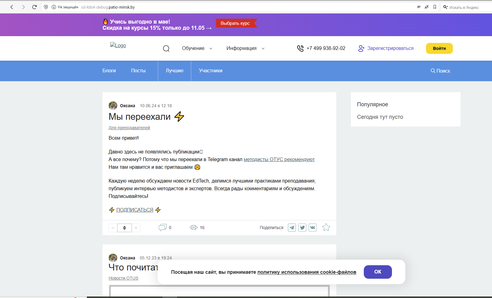
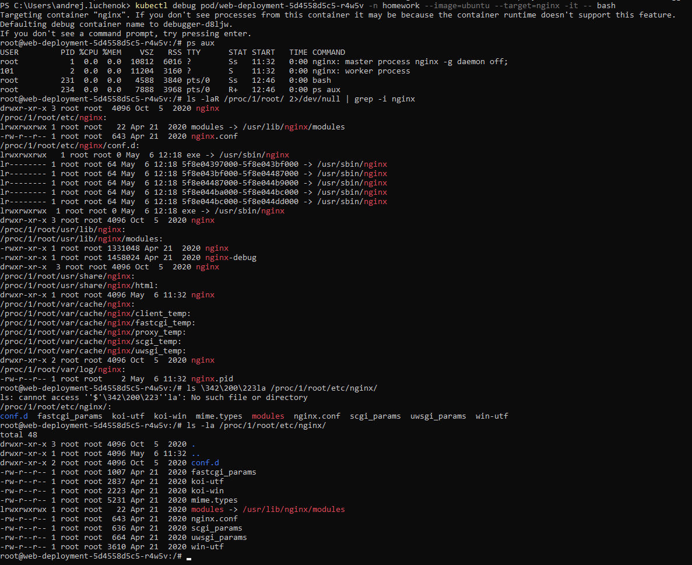
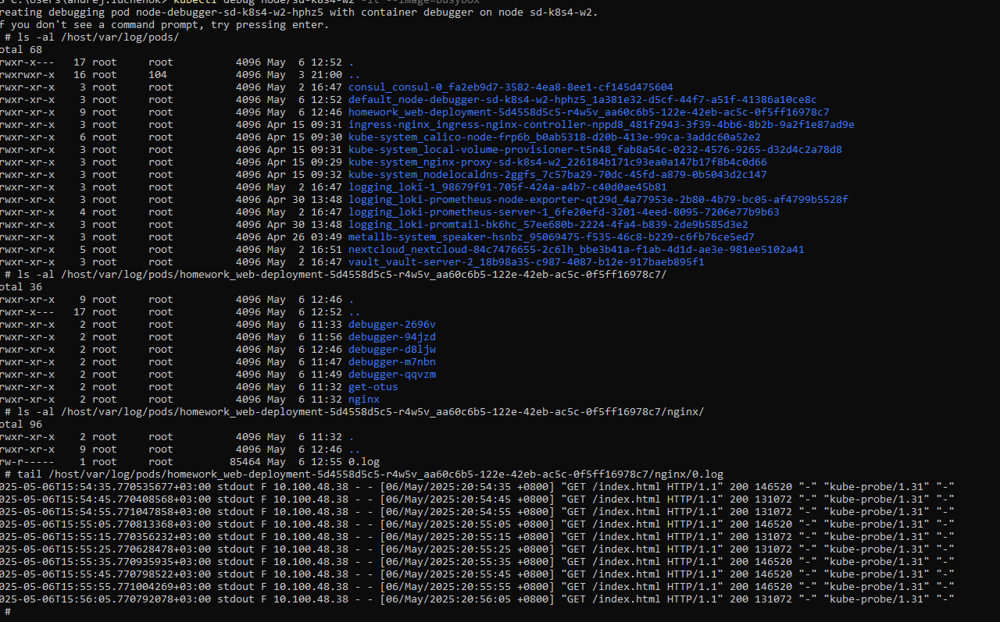
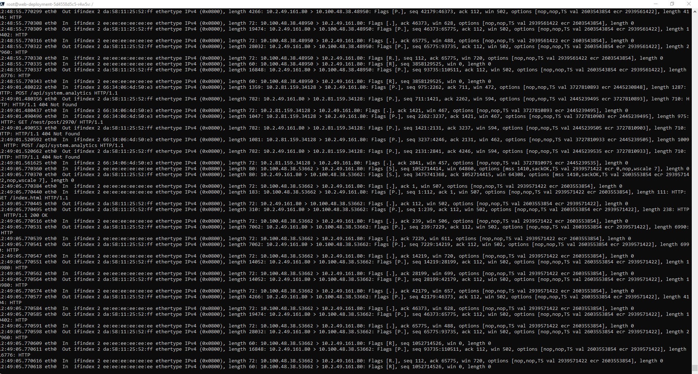
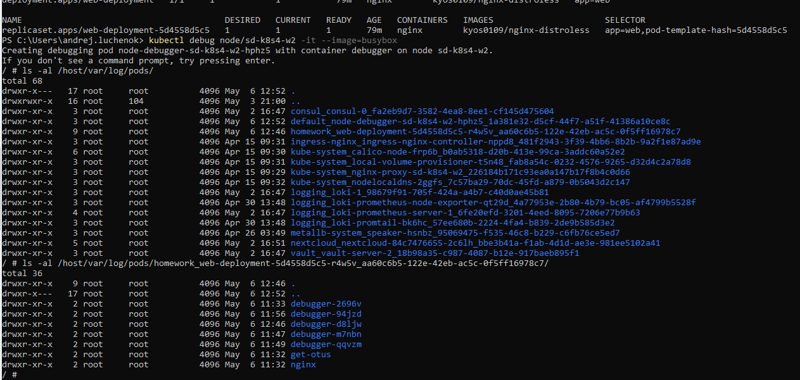
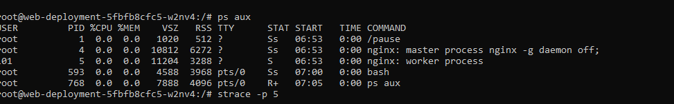
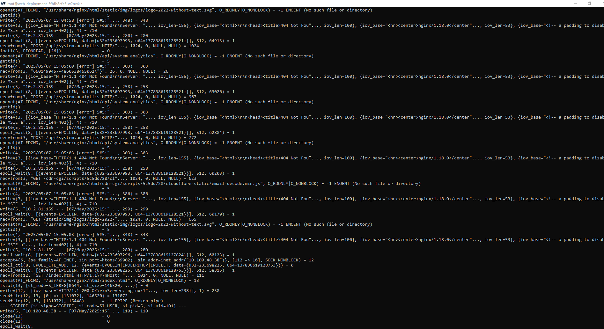

# 7. Шаблонизация манифестов приложения, использование Helm. Установка community Helm charts (ДЗ-6)

## Домашнее задание
1) Научится отлаживать контейнеры и ноды Kubernetes с помощью эфемерных контейнеров и kubectl debug  

**Диагностика пода.** 
Что надо сделать:
```
kubectl apply -f deployment.yaml
kubectl get all -n homework
kubectl debug pod/web-deployment-5d4558d5c5-r4w5v -n homework --image=ubuntu --target=nginx -it -- bash
```
Проверяем, что все работает    
 

Внутри пода выполняем:
```
# Смотрим процессы
ps aux
# Находим где же у нас nginx
ls -laR /proc/1/root/ 2>/dev/null | grep -i nginx
# Смотрим содержимое папки
ls -la /proc/1/root/etc/nginx/
# смотрим tcpdump
apt update && apt install tcpdump -y && tcpdump -nn -i any -e port 80
```  
Вывод содержимое папки nginx 
 

Вывод последних строчек лога nginx из ноды и прямого доступа к поду  
 

Вывод tcpdump  
 
  
**Диагностика нод**
```
# Смотрим, на какой ноде запущен наш deployment
kubectl get all -n homework -o wide
# смотрим название нод
kubectl get nodes
# Запускаем debug в образе busybox
kubectl debug node/sd-k8s4-w2 -it --image=busybox
ls -al /host/
ls -al /host/var/log/pods/
ls -al /host/var/log/pods/homework_web-deployment-5d4558d5c5-r4w5v_aa60c6b5-122e-42eb-ac5c-0f5ff16978c7/nginx/
# Смотрим логи nginx
tail /host/var/log/pods/homework_web-deployment-5d4558d5c5-r4w5v_aa60c6b5-122e-42eb-ac5c-0f5ff16978c7/nginx/0.log
```
Вывод списка файлов на ноде, на которой запущен наш deployment
 

Вывод последних строчек лога nginx из ноды и прямого доступа к поду  
 
  
**Задача со звездочкой.**
Для повышения привилегий и запуска strace надо добавить ключ "--profile=sysadmin"  
```
kubectl debug node/minikube -it --target=nginx --share-processes=true --image=ubuntu --profile=sysadmin -- /bin/bash
ps aux
# Находим процесс nginx: worker process - это ID 5
apt update && apt install strace -y && strace -p 5
```
Вывод запущенных процессов  
 

Пример strace  
 

*Литература:*  
Strace пока не победил, нашел тут информацию (но, не помогла).  
https://medium.com/@geekidea_81313/running-perf-in-docker-kubernetes-7eb878afcd42  
Информация про привилигированные режимы.  
https://www.eksworkshop.com/docs/security/pod-security-standards/  