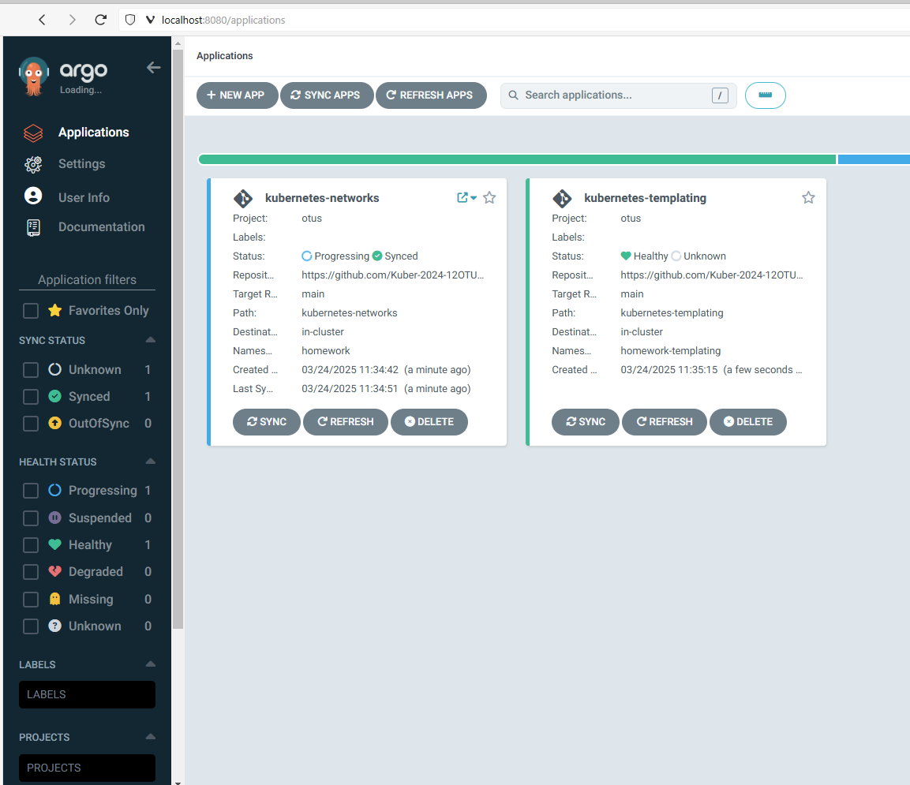
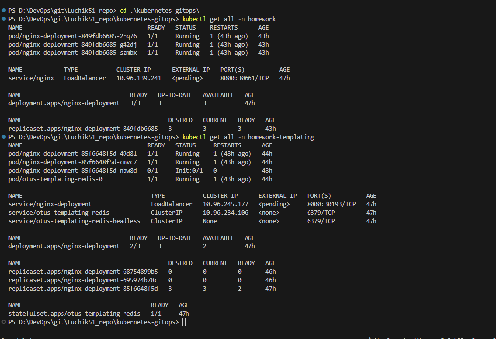
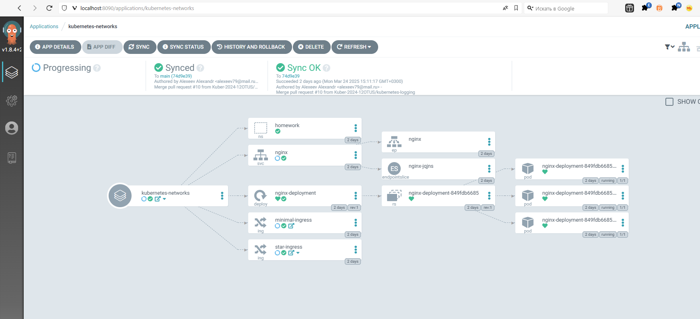

# GitOps и инструменты поставки

## Домашнее задание  
1) Установить в кластер ArgoCD и научится его конфигурировать  
2) Создать приложение, описывающее установку манифестов из git репозитория  
3) Создать приложение, описывающее установку из Helm-чарта, хранящегося в Git-репозитории  

**Что сделано:**  
С помощь Helmfile в кластер устанавливаеться ArgoCD.  
С помощью манифестов создаётся новый проект с ограничениями на создание namespace и добавления источников для проектов.  
С помощью манифестов создаются Application для ArgoCD. Один использует просто манифесты, второй helm из git-репозитория.
Столкнулся с проблемой: "Multi-Attach error for volume "<volume-name>" Volume is already exclusively attached to one node and can't be attached to another" при 3-х репликах. 2 pod запустились, а один никак не сталтовал и такую ошибку выдавал.  
Пришлось установить в кластер "Container Storage Interface для S3" и запускать pvc.yaml
**Для запуска:**
```
helmfile sync
kubectl apply -f argocd-project.yaml
kubectl apply -f argocd-app-manifest.yaml
kubectl apply -f argocd-app-helm.yaml
kubectl apply -f pvc.yaml
```
**label web-server=nginx**  
Мое приложение требует, что бы нода имела метку "web-server=nginx". Поэтому помечаем ноду:
```
kubectl get nodes --show-labels
kubectl label nodes cl177pfvrmolklovlenm-ijeg web-server=nginx
# Получаем пароль от ArgoCD
kubectl -n argocd get secret argocd-initial-admin-secret -o jsonpath="{.data.password}" | base64 -d
kubectl -n argocd get secret argocd-initial-admin-secret -o jsonpath="{.data.password}" | ForEach-Object { [System.Text.Encoding]::UTF8.GetString([System.Convert]::FromBase64String($_)) }
admin
jGAe1pPRmE7CB5vf

kubectl port-forward -n argocd service/argocd-server 8090:80
https://localhost:8090/applications

## Taint и Label
kubectl taint nodes <node-name> node-role=infra:NoSchedule
kubectl get nodes --show-labels
kubectl label node <node-name> node-role=infra

В моём случае:
kubectl label node cl177pfvrmolklovlenm-ixuv node-role=infra
kubectl taint nodes cl177pfvrmolklovlenm-ixuv node-role=infra:NoSchedule
kubectl label nodes cl1mnlucleef3vunqouc-yhof web-server=nginx
```

**Argocd**
 


**kubectl get all -n homework**
**kubectl get all -n homework-templating**
 


**homework-network**
 


Ручной вариант запуска:
```
helm upgrade --install argocd argo/argo-cd \
  --namespace argocd \
  --create-namespace \
  --set global.nodeSelector.node-role=infra \
  --set global.tolerations[0].key=node-role \
  --set global.tolerations[0].operator=Equal \
  --set global.tolerations[0].value=infra \
  --set global.tolerations[0].effect=NoSchedule

или

helm upgrade --install argocd argo/argo-cd --namespace argocd --create-namespace --set global.nodeSelector.node-role=infra --set global.tolerations[0].key=node-role --set global.tolerations[0].operator=Equal --set global.tolerations[0].value=infra --set global.tolerations[0].effect=NoSchedule
 ```
