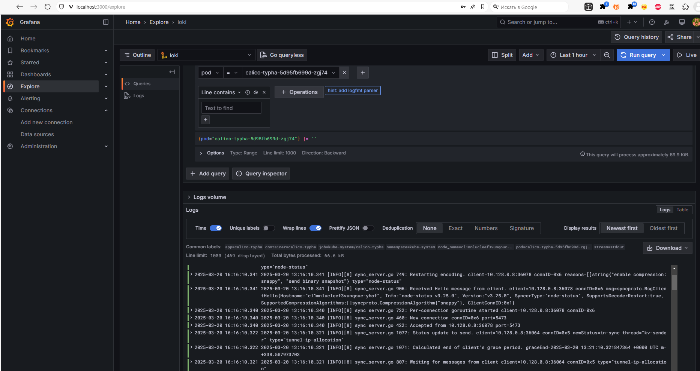
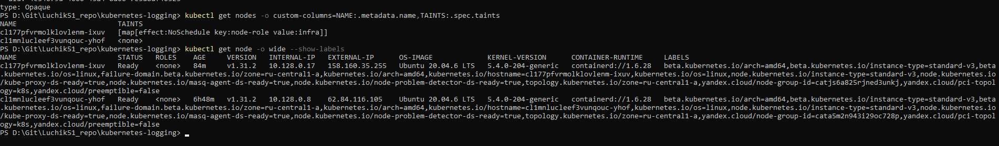
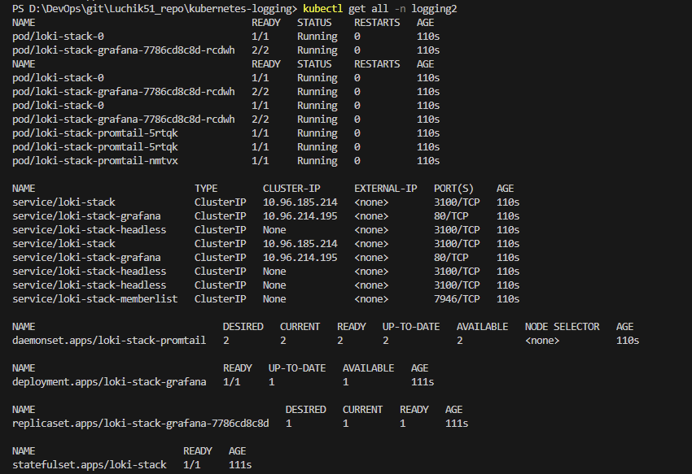
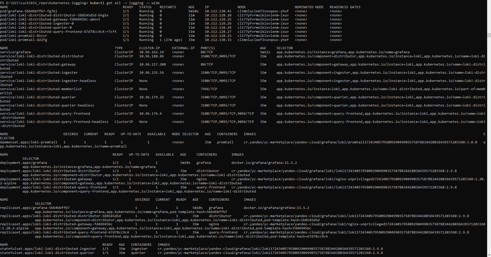
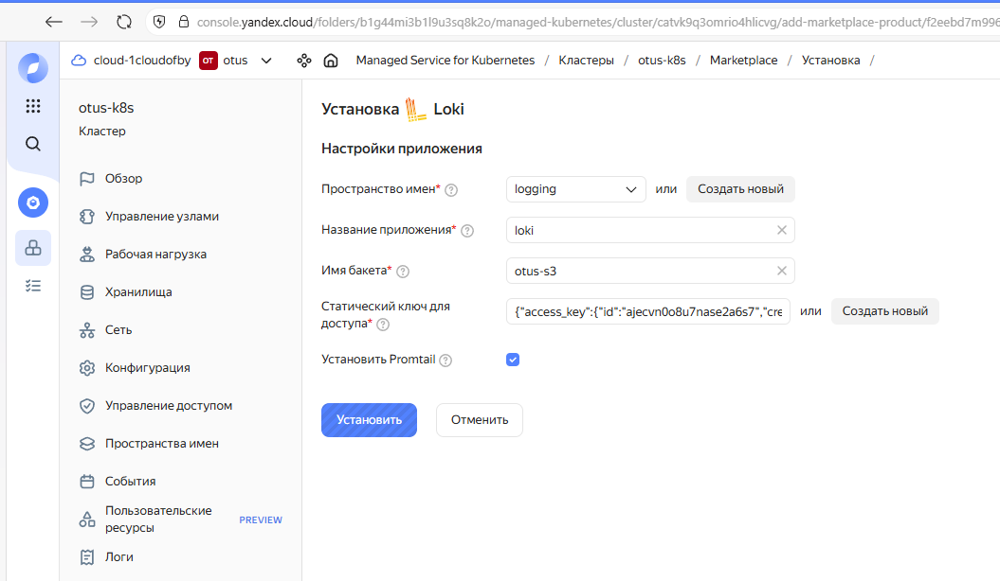

# Сервисы централизованного логирования для kubernetes

## Домашнее задание  
1) Используем Yandex Cloud
2) Установить в кластер loki и научиться его конфигурировать
3) научиться собирать логи с нод кластера с помощью promtail
4) настроить подключение grafana и loki

**Что сделано:**  


**Для запуска:**
```
# Вариант 1
source .env
helmfile sync

# Вариант 2
Yandex Marketplace
https://console.yandex.cloud/folders/b1g44mi3b1l9u3sq8k2o/marketplace/products/f2eebd7m996cqd7umqbd

# Вариант 3
helm repo add grafana https://grafana.github.io/helm-charts
helm repo update
helm upgrade --install loki grafana/loki-stack --namespace logging --create-namespace
helm upgrade --install grafana grafana/grafana --namespace logging --create-namespace

# Узнаём пароль Grafana
## В Linux
# kubectl get secret --namespace logging grafana -o jsonpath="{.data.admin-password}" | base64 --decode ; echo
## В Powershell
kubectl get secret --namespace logging grafana -o jsonpath="{.data.admin-password}"| ForEach-Object { [System.Text.Encoding]::UTF8.GetString([System.Convert]::FromBase64String($_)) }

# делаем пробром порта для подключения к grafana
kubectl port-forward -n logging service/loki-stack-grafana 3000:80
http://localhost:3000/login
```

taint
```
kubectl get nodes
kubectl taint nodes <node-name> node-role=infra:NoSchedule
## Проверка
kubectl describe node <node-name>
kubectl get node -o wide --show-labels
kubectl get nodes -o custom-columns=NAME:.metadata.name,TAINTS:.spec.taints
## Удаление
kubectl taint nodes <node-name> node-role=infra:NoSchedule-
```

grafana 
 

taint
 

loki-stack
 

loki-yandex
 

yandex-marketplace Loki
 
