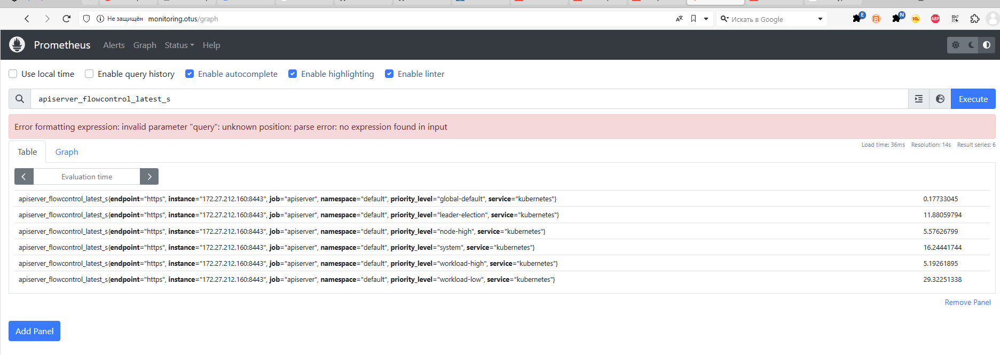
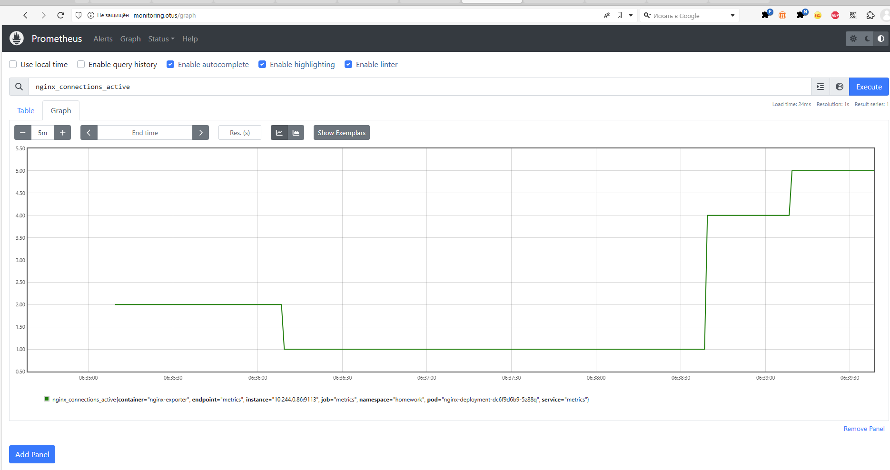
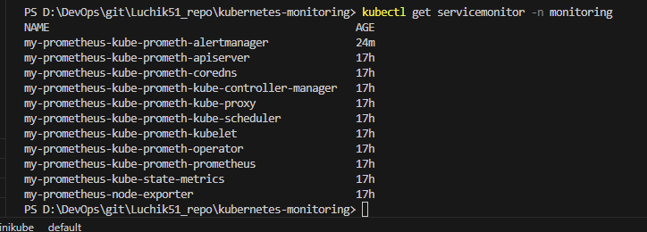
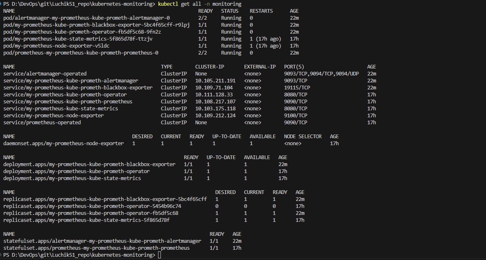

# 9. Мониторинг приложения в кластере


## Домашнее задание  
1) Установить в кластер и научиться пользоваться prometheus-operator 
2) Научиться инструментировать ваше приложение и собирать с него метрики в Prometheus-формате 

**Что сделано:**  
Файлы скопирвоаны с ДЗ kubernetes-templating.


**Для запуска:**
```
minikube delete
minikube start
kubectl label nodes minikube web-server=nginx
minikube addons enable ingress


kubectl apply -f storageClass.yaml
helmfile sync
kubectl apply -f pvc.yaml

```

**Проверяем:**
```
minikube tunnel
kubectl get ingress -A 
# прописываем address в hosts
kubectl get all -n monitoring
kubectl get servicemonitor -n monitoring
kubectl get clusterrole | Select-String "prometheus"
kubectl describe clusterrole my-prometheus-kube-state-metrics-monitoring
http://monitoring.otus/
http://homework.otus/
http://homework.otus/stats

```

Что получилось:  
http://monitoring.otus/ - табличное предстваление  
  
http://monitoring.otus/ - графики
  
kubectl get servicemonitor -n monitoring  
  
kubectl get all -n monitoring  
  


**Диагностика:**  
 
```
minikube addons enable metrics-server
kubectl top nodes
kubectl top pods -A
# Если надо увеличить ресурсы minikube:
# minikube start --cpus=4 --memory=8192 ## не работает
# minikube start --memory=max --cpus=max ## не работает
minikube config set memory 6144
minikube config set cpus 4
minikube delete
minikube start

minikube config view
#Альтернатива
helm install prometheus oci://registry-1.docker.io/bitnamicharts/kube-prometheus  --set resources.requests.cpu=100m --set resources.limits.cpu=200m -n monitoring --create-namespace

# удаляем все через helmfile
helmfile destroy

kubectl describe node minikube
kubectl delete all --all -n prod
kubectl delete all --all -n homework
kubectl delete serviceaccount monitoring -n homework
kubectl get ConfigMap -n homework 
kubectl delete ConfigMap html-config -n homework
kubectl delete ClusterRole metrics-reader
kubectl delete ClusterRoleBinding metrics-access
kubectl get all -A
kubectl get ingress -A
```

Всякое:  
```
# Установка плагинов для helm (helmfile)
helm plugin install https://github.com/databus23/helm-diff
helm plugin install https://github.com/aslafy-z/helm-git
helm plugin install https://github.com/jkroepke/helm-secrets
helmfile --file filename.yaml apply
# Установка kustomize в Windows
choco install kustomize
kustomize version
```