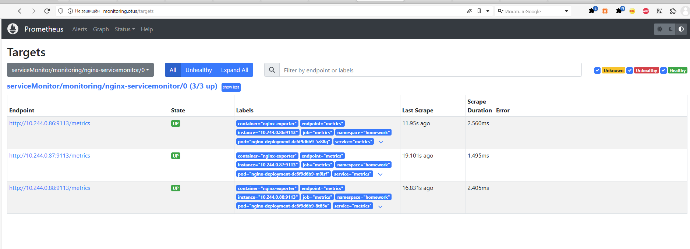

# 9. Мониторинг приложения в кластере


## Домашнее задание  
1) Установить в кластер и научиться пользоваться prometheus-operator 
2) Научиться инструментировать ваше приложение и собирать с него метрики в Prometheus-формате 

**Что сделано:**  
Файлы скопирвоаны с ДЗ kubernetes-templating.


**Для запуска:**
```
minikube delete
minikube start
kubectl label nodes minikube web-server=nginx
minikube addons enable ingress


kubectl apply -f storageClass.yaml
helmfile sync
kubectl apply -f pvc.yaml
kubectl apply -f servicemonitor.yaml

```

**Проверяем:**
```
minikube tunnel
kubectl get ingress -A 
# прописываем address в hosts
kubectl get all -n monitoring
kubectl get servicemonitor -n monitoring
kubectl describe servicemonitor nginx-servicemonitor -n monitoring
kubectl get clusterrole | Select-String "prometheus"
kubectl describe clusterrole my-prometheus-kube-state-metrics-monitoring
# смотрим логи метрики nginx.
kubectl logs nginx-deployment-77dd58cdc7-5hps5 -c nginx-exporter -n homework
kubectl exec -it pod/nginx-deployment-74fbf7df8f-5rns9 -c otus -n homework -- curl http://metrics:9113/metrics
http://monitoring.otus/
http://homework.otus/
http://homework.otus/metrics
http://homework.otus/metrics-k8s.html

```

Что получилось:  
http://monitoring.otus/ - Targets nginx  
  
http://monitoring.otus/ - Выбор меток и данных  
  
http://monitoring.otus/ - табличное предстваление  
  
http://monitoring.otus/ - графики
  
kubectl get servicemonitor -n monitoring  
  
kubectl get all -n monitoring  
  


**Диагностика:**  

Потребление ресурсов подами, на ноде
```
minikube addons enable metrics-server
kubectl top nodes
kubectl top pods -A
# Если надо увеличить ресурсы minikube:
# minikube start --cpus=4 --memory=8192 ## не работает
# minikube start --memory=max --cpus=max ## не работает
minikube config set memory 6144
minikube config set cpus 4
minikube delete
minikube start
minikube config view
minikube ssh "free -mh"
```

Установка prometheus через helm #Альтернатива 
```
helm install prometheus2 oci://registry-1.docker.io/bitnamicharts/kube-prometheus  --set resources.requests.cpu=100m --set resources.limits.cpu=200m -n monitoring --create-namespace
helm install prometheus2 oci://registry-1.docker.io/bitnamicharts/kube-prometheus -n monitoring --create-namespace
helm uninstall prometheus2 -n monitoring
helm list -n monitoring
```

Как диагностировать сайт:
```
Через под nginx и localhost
kubectl get all -n homework
kubectl get all -n monitoring
kubectl exec -it pod/nginx-deployment-74fbf7df8f-5rns9 -c otus -n homework -- curl http://localhost:8000
kubectl exec -it pod/nginx-deployment-74fbf7df8f-5rns9 -c otus -n homework -- curl http://localhost:8000/metrics - метрики nginx (работает или нет, колличесво подключений)
kubectl exec -it pod/nginx-deployment-74fbf7df8f-5rns9 -c otus -n homework -- curl http://localhost:8000/homework/metrics-k8s.html - все метрики кластера
Тоже самое через сервис. Сервис распределяет
kubectl exec -it pod/nginx-deployment-74fbf7df8f-5rns9 -c otus -n homework -- curl http://nginx-deployment:8000
kubectl exec -it pod/nginx-deployment-74fbf7df8f-5rns9 -c otus -n homework -- curl http://nginx-deployment:8000/metrics
kubectl exec -it pod/nginx-deployment-74fbf7df8f-5rns9 -c otus -n homework -- curl http://metrics:9113 - должен отдать страничку с инф о прометеусе (контейнер nginx-exporter)
kubectl exec -it pod/nginx-deployment-74fbf7df8f-5rns9 -c otus -n homework -- curl http://metrics:9113/metrics
Проверка сервиса (должны быть enpoint, проверить target port)
kubectl describe service/nginx-deployment -n homework
kubectl describe service/metrics -n homework
```
### Диагностика nginx-exporter для prometheus.  
В prometheus/target должен появится:  
serviceMonitor/monitoring/nginx-servicemonitor/0 (3/3 up)  
Если (0/3 up) - тогда есть проблемы. Там описаны, куда стучится и надо перепроверить всё. У меня сейчас так: "Get "http://10.244.0.50:9113/metrics": context deadline exceeded"
Я так понимаю путь: prometheus (target) -> servicemonitor (app: metrics path: /metrics) -> service/metrics (смоьтрим labels и Endpoints) -> pod (смотрим порт и работоспособность веб-сервера)


# удаляем все через helmfile
```
helmfile destroy

kubectl describe node minikube
kubectl delete all --all -n prod
kubectl delete all --all -n homework
kubectl delete serviceaccount monitoring -n homework
kubectl get ConfigMap -n homework 
kubectl delete ConfigMap html-config -n homework
kubectl delete ClusterRole metrics-reader
kubectl delete ClusterRoleBinding metrics-access
kubectl get all -A
kubectl get ingress -A
kubectl describe pod/prom-kube-prometheus-blackbox-exporter-559cbcb967-g4l9z -n monitoring
```

Всякое:  
```
# Установка плагинов для helm (helmfile)
helm plugin install https://github.com/databus23/helm-diff
helm plugin install https://github.com/aslafy-z/helm-git
helm plugin install https://github.com/jkroepke/helm-secrets
helmfile --file filename.yaml apply
# Установка kustomize в Windows
choco install kustomize
kustomize version
```