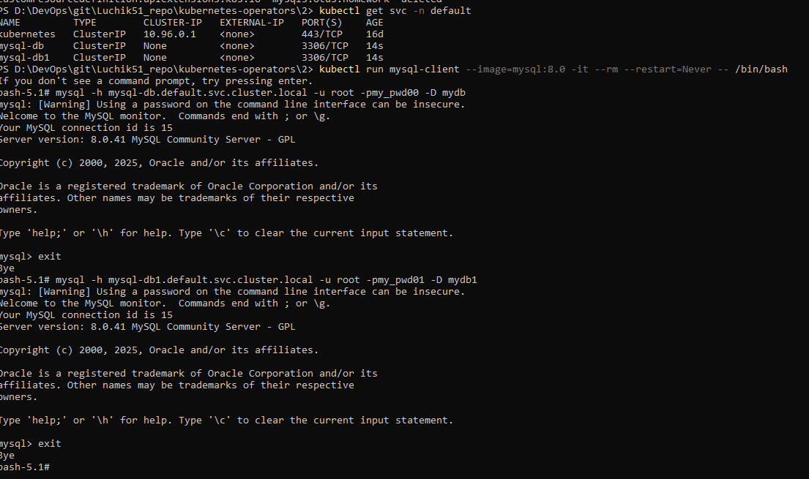
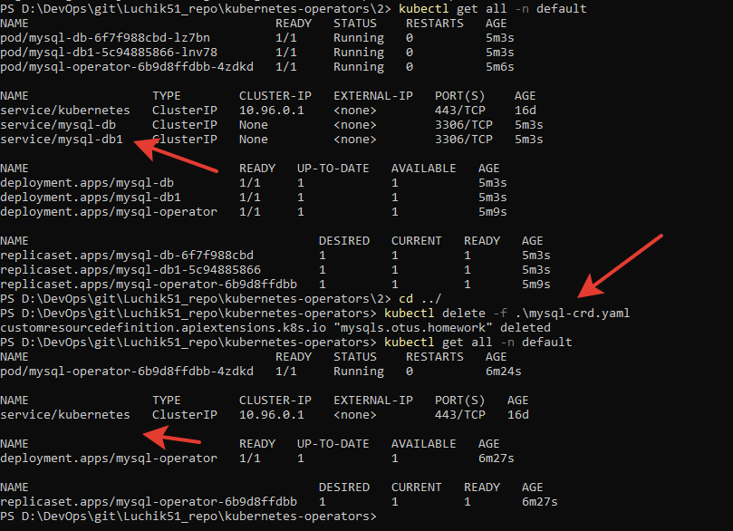

# 8. Custom Resource Definitions. Operators


## Домашнее задание  
1) Научится создавать и конфигурировать CR и CRD ресурсы  
2) Научиться создавать и устанавливать в кластер собственные Operators   


**Для запуска:**
```
kubectl apply -f .
```

**Проверяем:**
```
kubectl get all -n default
kubectl get crd mysqls.otus.homework
# Проверяем подключение
kubectl run mysql-client --image=mysql:8.0 -it --rm --restart=Never -- /bin/bash
# шаблон: mysql -h mysql-sample.default.svc.cluster.local -u <username> -p<password> -D <database-name>
mysql -h mysql-db.default.svc.cluster.local -u root -pmy_pwd00 -D mydb
mysql -h mysql-db1.default.svc.cluster.local -u root -pmy_pwd01 -D mydb1
```
  


Удаляем CRD и проверяем, что удалились наши базы mysql:
```
kubectl delete -f .\mysql-crd.yaml
# Принудительно:
kubectl patch crd mysqls.otus.homework -p '{"metadata":{"finalizers":[]}}' --type=merge
```

  


**Диагностика:**  
Возникали ошибки с правами доступа.  
```
kubectl logs <controller-pod-name> -n <controller-namespace>
kubectl logs pod/mysql-operator-6b9d8ffdbb-4gd7j
kubectl auth can-i get deployments/status --as=system:serviceaccount:default:mysql-operator -n default
```