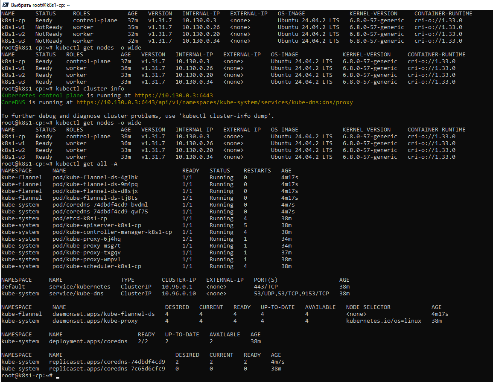
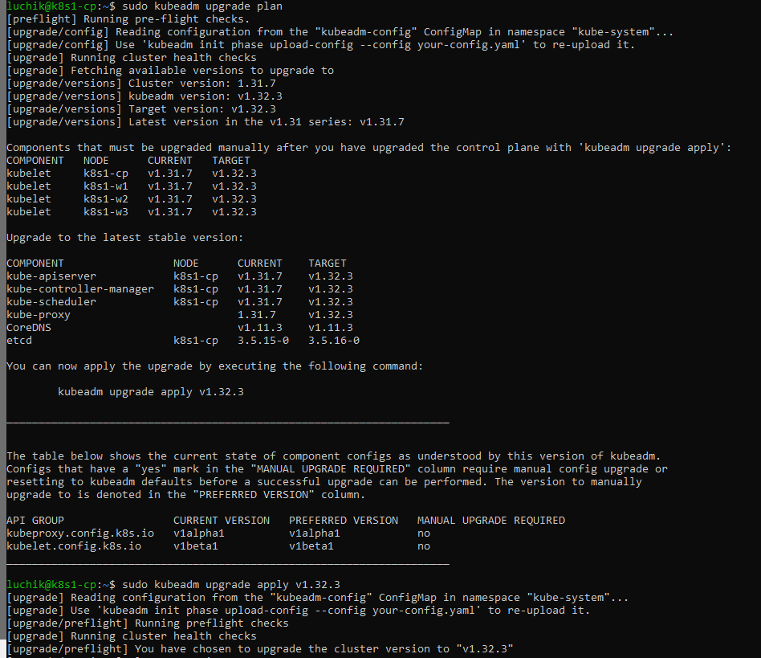
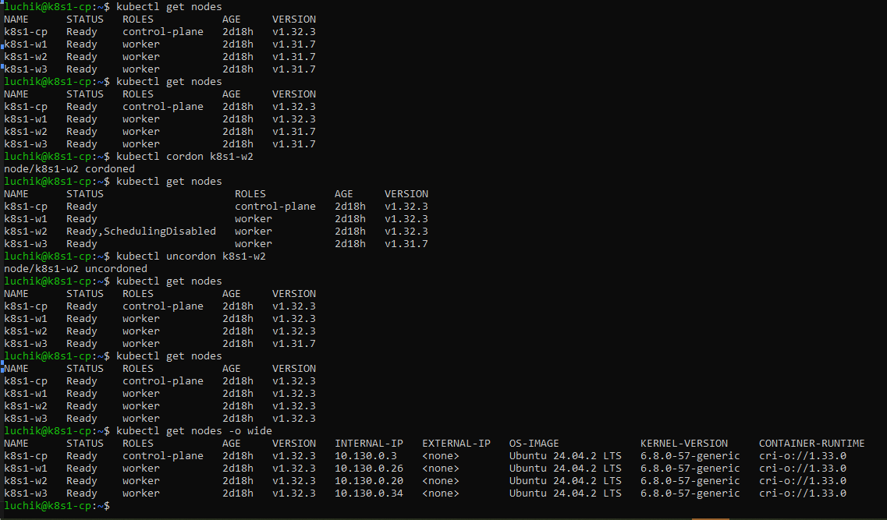
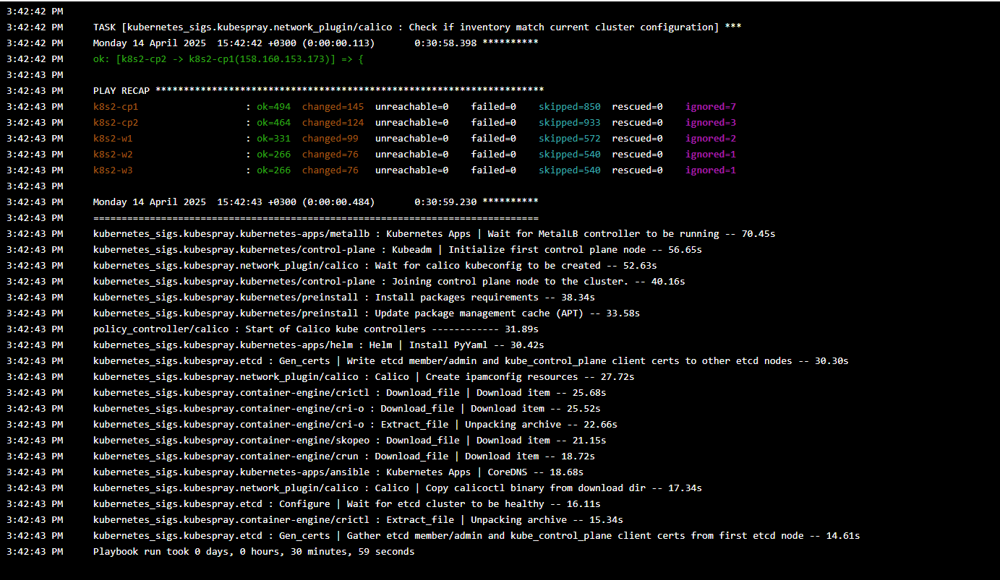
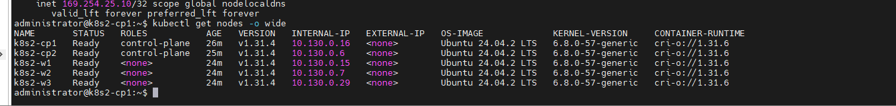

# 14. Подходы к развертыванию и обновлению production-grade кластера 

## Домашнее задание  
1) Создать кластер с использованием kubeadm  
2) Понимать как обновить кластер до нужной версии kubernetes с использованием kubeadm  
3) Создатþ кластер с исполþзованием kubespray  

## Установка Kubernetes с помощью kubeadm
1) Обычное задание
Создаёт виртуальные машины на Yandex Cloud с нашим публичным ключем. Вот так его можно скопировать с помощью Powershell
```
type C:\Users\andrej.luchenok\.ssh\id_ed25519.pub | clip
```
Подготавливаем все сервера:  
```
KUBERNETES_VERSION=v1.31 && \
sudo bash -c '
  curl -fsSL https://pkgs.k8s.io/core:/stable:/'"$KUBERNETES_VERSION"'/deb/Release.key | gpg --dearmor -o /etc/apt/keyrings/kubernetes-apt-keyring.gpg && \
  echo "deb [signed-by=/etc/apt/keyrings/kubernetes-apt-keyring.gpg] https://pkgs.k8s.io/core:/stable:/'"$KUBERNETES_VERSION"'/deb/ /" > /etc/apt/sources.list.d/kubernetes.list && \
  curl -fsSL https://pkgs.k8s.io/addons:/cri-o:/prerelease:/main/deb/Release.key | gpg --dearmor -o /etc/apt/keyrings/cri-o-apt-keyring.gpg && \
  echo "deb [signed-by=/etc/apt/keyrings/cri-o-apt-keyring.gpg] https://pkgs.k8s.io/addons:/cri-o:/prerelease:/main/deb/ /" > /etc/apt/sources.list.d/cri-o.list && \
  swapoff -a && sed -i '\''/ swap / s/^/#/'\'' /etc/fstab && \
  echo "br_netfilter" >> /etc/modules-load.d/modules.conf && \
  sed -i '\''s/#net.ipv4.ip_forward=1/net.ipv4.ip_forward=1/g'\'' /etc/sysctl.conf
' && \
sudo apt update && \
sudo apt install -y cri-o kubelet kubeadm kubectl && \
sudo apt-mark hold kubelet kubeadm kubectl && \
sudo apt upgrade -y && \
crio --version && kubelet --version && kubeadm version && kubectl version --client && \
sudo reboot now
```
  
На control plane сервере:  
Инициализируем кубернетес-кластер. Копируем ключ к себе у учетную запись и копируем команду для подключения воркеров к кластеру.
```
sudo bash -c 'curl https://raw.githubusercontent.com/helm/helm/main/scripts/get-helm-3 | bash' && \
sudo kubeadm init --pod-network-cidr=10.244.0.0/16 --cri-socket=unix:///var/run/crio/crio.sock
# После инициализации kubernetes устанавливаем flannel
mkdir -p $HOME/.kube && \
sudo cp -i /etc/kubernetes/admin.conf $HOME/.kube/config && \
sudo chown $(id -u):$(id -g) $HOME/.kube/config && \
kubectl create ns kube-flannel && \
kubectl label --overwrite ns kube-flannel pod-security.kubernetes.io/enforce=privileged && \
helm repo add flannel https://flannel-io.github.io/flannel/ && \
helm install flannel flannel/flannel --values values.yaml -n kube-flannel && \
kubectl -n kube-system patch deployment coredns --type json -p '[{"op":"add","path":"/spec/template/spec/tolerations/-","value":{"key":"node.cloudprovider.kubernetes.io/uninitialized","value":"true","effect":"NoSchedule"}}]'
```
На Worker серверах - присоединяем к кластеру:  
```
sudo kubeadm join 10.130.0.3:6443 --token <tocken> \
        --discovery-token-ca-cert-hash <hash>
```
Маркируем (На control plane):  
```
kubectl label node k8s1-w1 node-role.kubernetes.io/worker=worker && \
kubectl label node k8s1-w2 node-role.kubernetes.io/worker=worker && \
kubectl label node k8s1-w3 node-role.kubernetes.io/worker=worker
```

**kubeadm-1.31**
 

**Обновление кластера:**
На control plane:  
```
KUBERNETES_VERSION=v1.32 && \
sudo bash -c '
  curl -fsSL https://pkgs.k8s.io/core:/stable:/'"$KUBERNETES_VERSION"'/deb/Release.key | gpg --dearmor -o /etc/apt/keyrings/kubernetes-apt-keyring.gpg && \
  echo "deb [signed-by=/etc/apt/keyrings/kubernetes-apt-keyring.gpg] https://pkgs.k8s.io/core:/stable:/'"$KUBERNETES_VERSION"'/deb/ /" > /etc/apt/sources.list.d/kubernetes.list
' && \
sudo apt-mark unhold kubeadm kubelet && \
sudo apt update && sudo apt-cache madison kubeadm | tac && \
sudo apt install kubeadm=1.32.3-1.1 && \
sudo kubeadm upgrade plan && \
sudo kubeadm upgrade apply v1.32.3 && \
sudo apt-mark hold kubeadm kubelet && \
sudo systemctl daemon-reload && \
sudo systemctl restart kubelet && \
kubectl get nodes
```

Желательно при обновлении воркеров освобождать их от рабочей нагрузки. Выполняем на контрол плэйне.
```
kubectl cordon k8s1-w1
#kubectl drain controlplane --ignore-daemonsets
# после обновления возвращаем рабочую нагрузку назад
kubectl uncordon k8s1-w1
```
Так делаем с каждым воркером.  

**kubeadm-upgrade**
 
  
на Worker-ах:  
```
KUBERNETES_VERSION=v1.32 && \
sudo bash -c '
  curl -fsSL https://pkgs.k8s.io/core:/stable:/'"$KUBERNETES_VERSION"'/deb/Release.key | gpg --dearmor -o /etc/apt/keyrings/kubernetes-apt-keyring.gpg && \
  echo "deb [signed-by=/etc/apt/keyrings/kubernetes-apt-keyring.gpg] https://pkgs.k8s.io/core:/stable:/'"$KUBERNETES_VERSION"'/deb/ /" > /etc/apt/sources.list.d/kubernetes.list
' && \
sudo apt-mark unhold kubelet && \
sudo apt update && sudo apt install kubelet=1.32.3-1.1 -y && \
sudo apt-mark hold kubelet && \
sudo systemctl daemon-reload && \
sudo systemctl restart kubelet
```

**kubeadm-1.32**
 

Уничтожить кластер:  
Может быть понадобиться  
```
sudo kubeadm reset
rm $HOME/.kube/config
```
Не удаляет (не очищает) внешний ecdt.


## Установка Kubernetes с помощью Kubespray
Предварительно закидываем на виртуальные машины ssh ключ, что бы без паролей подключаться. И запускаем плэйбук. Использовалась коллекция   
```
- name: https://github.com/kubernetes-sigs/kubespray
  type: git
```
Вывод консоли Ansible:  
**kubespray-ansible**
 

Вывод kubectl:  
**kubespray-kubectl**
