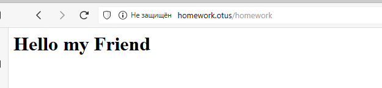
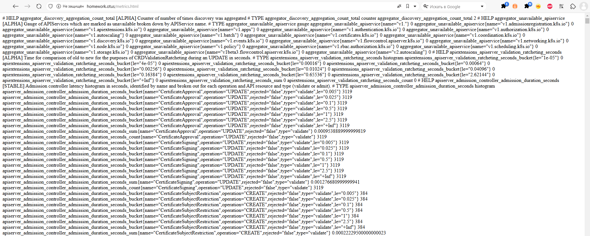
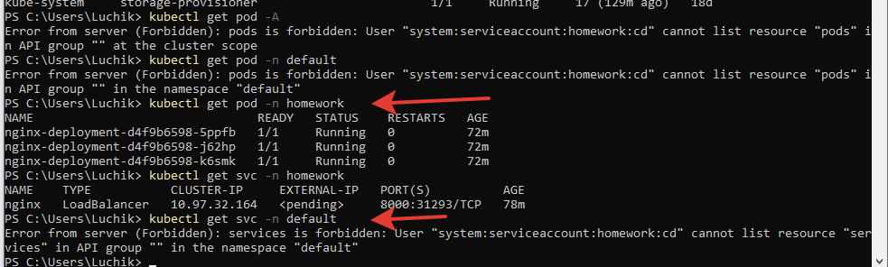

# 4. Сетевая подсистема и сущности Kubernetes (ДЗ-3)

## Домашнее задание
1) Получить предстваление об объекте ServiceAccaunt (SA) 
2) Научится настраивать bindings для ServiceAccaunt с различными правами на уровне namespace и кластера.  
3) Понять механизм работы секретов, которые создаются для SA

Документация:  
[Service Accounts](https://kubernetes.io/docs/concepts/security/service-accounts/)  
[Using RBAC Authorization](https://kubernetes.io/docs/reference/access-authn-authz/rbac/)  
[Organizing Cluster Access Using kubeconfig Files](https://kubernetes.io/docs/concepts/configuration/organize-cluster-access-kubeconfig/)  


**Для запуска приложения надо:**  
Установить ingress-контроллер:  
```
minikube addons enable ingress
```

Если с нуля:  
Проставить метку на ноду  
```
kubectl label nodes minikube web-server=nginx
```

Добавить в c:\Windows\System32\drivers\etc\hosts
```
127.0.0.1 homework.otus
```
В отдельной консоли запустить туннель для проброса портов с миникуба на локальную машину:  
[Описание minikube tunnel](https://minikube.sigs.k8s.io/docs/commands/tunnel/)
```
minikube tunnel
```

Запускаемся:
```
kubectl apply -f .\storageClass.yaml
kubectl apply -f .\namespace.yaml -n homework
kubectl apply -f .\pvc.yaml -n homework
kubectl apply -f .\cm.yaml -n homework
kubectl apply -f .\ServiceAccountMonitoring.yaml -n homework
kubectl apply -f .\deployment.yaml -n homework
kubectl apply -f .\service.yaml -n homework
kubectl apply -f .\ingress.yaml -n homework


```
Добавить в Hosts домен:
```
kubectl get ingress --all-namespaces
# в поле ADDRESS появился 172.19.221.196. Его прописываем в hosts файл.
```

Проверяем:  
http://homework.otus/  
http://homework.otus/conf/file - предложит скачать файл, в котором будет содержимое из cm.yaml  
http://homework.otus/metrics.html  

Kubeconfig - позволяет сделать свой, ограниченный, доступ в кластер. Был создан сервисный аккаунт CD. С помощью команды:  
```
kubectl create token cd -n homework --duration=24h
```
формируеться ключ для использования этого сервисного аккаунта CD. Его надо вставить в файле kubeconfig в поле token: <tocken>  
Для проверки запрашиваем поды и namespace homework и default.  


Скриншот, что получилось:  
  
  
  

  


Быстрое переключение на другой конфиг:  
Для Linux (bash):  
```
# Как установить переменную окружения в PowerShell
export KUBECONFIG=./kubeconfig.yaml
# Как проверить значение переменной
echo $KUBECONFIG
# Как сбросить переменную
export KUBECONFIG=~/.kube/config
# Как проверить текущую конфигурацию
kubectl config view
```
Для Windows (Powershell):
```
# Как установить переменную окружения в PowerShell
$env:KUBECONFIG = "$HOME\.kube\kubeconfig"
# Как проверить значение переменной
echo $env:KUBECONFIG
# Как сбросить переменную
$env:KUBECONFIG = $null
# Как объединить несколько kubeconfig
$env:KUBECONFIG = "$HOME\.kube\kubeconfig";".\kubeconfig.yaml"
# Как проверить текущую конфигурацию
kubectl config view
```
  

Диагностика:  
```
Проверить метки:
kubectl get pods -n homework --show-labels
# проверить статус ingress
kubectl get pods -n ingress-nginx
# МОжно посмотреть от какого аккаунта запущены поды
kubectl get pods/nginx-deployment-5f484b877f-r6qkd -n homework -o yaml
kubectl describe svc -n homework
# Если не стартует.
kubectl label nodes minikube minikube.k8s.io/primary=true
# Проверить работоспособность сервиса и служб
kubectl get svc -n homework
kubectl describe svc -n homework
# Проверить работоспособность отдавать страничку через айпи service
kubectl exec nginx-deployment-fc47f888f-ltpn4 -c nginx -n homework -- curl http://10.104.80.214:8000
kubectl exec -it nginx-deployment-7df7c55cdd-7pwxj -c nginx -n homework -- /bin/sh
> curl -k -H "Authorization: Bearer $(cat /var/run/secrets/kubernetes.io/serviceaccount/token)" https://kubernetes.default.svc.cluster.local/metrics > /homework/metrics.html
# если не использовать токен, то пользователь будет использоваться анонимный.
# Если понадобавиться удалить деплоймент
kubectl delete -f .\deployment.yaml -n homework
# Список сервисных аккаунтов
kubectl get ServiceAccount -n homework
# kubectl create token cd -n homework --duration=24h
<tocken>
```