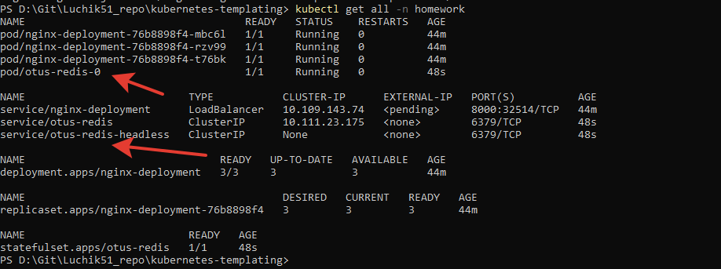
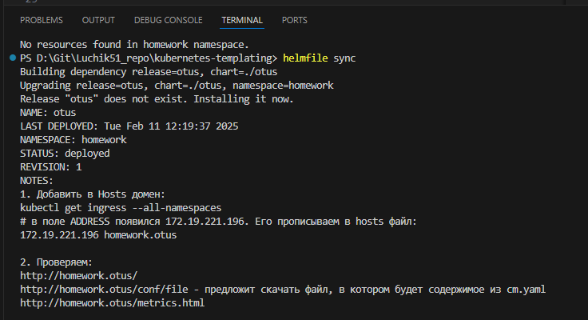
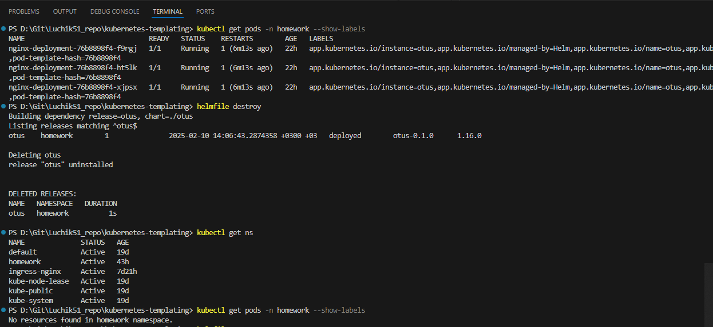
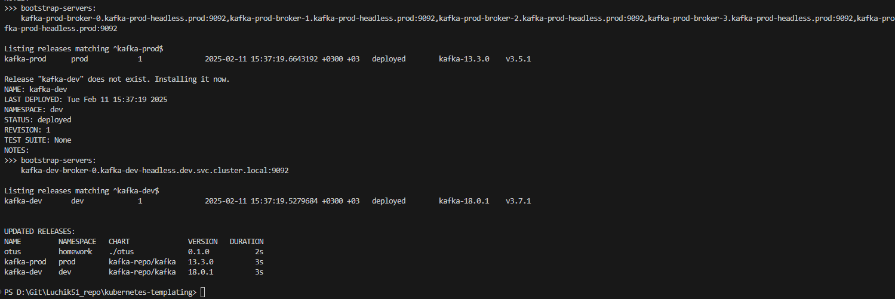

# 7. Шаблонизация манифестов приложения, использование Helm. Установка community Helm charts (ДЗ-6)

## Домашнее задание
1) Научится создавать собственные helm-chart ит деплоить их в кластер k8s  
2) Научиться устанавливать community helm chart из публичных репозиториев.  
3) Научиться использовать helmfile для описания релизов

Удалим все старое:  
```
kubectl delete all --all -n homework
kubectl get ClusterRole -n homework
kubectl delete ClusterRole metrics-reader -n homework
kubectl get ClusterRoleBinding -n homework
kubectl delete ClusterRoleBinding metrics-access -n homework
```
Если с нуля:  
Проставить метку на ноду  
```
kubectl label nodes minikube web-server=nginx
```

**HelmFile**  
От текущего пользователя (без административных прав) в Powershell 5.1+:
```
Set-ExecutionPolicy -ExecutionPolicy RemoteSigned -Scope CurrentUser
Invoke-RestMethod -Uri https://get.scoop.sh | Invoke-Expression
# Поиск приложений для установки:
# https://scoop.sh/#/apps?q=helm
scoop install helmfile helm
# winget uninstall helm
# scoop uninstall helm
# scoop uninstall helmfile
```

В Linux так:
```
curl -Lo helmfile.tar.gz https://github.com/helmfile/helmfile/releases/download/v1.0.0-rc.10/helmfile_1.0.0-rc.11_linux_amd64.tar.gz
tar -xzf helmfile.tar.gz
chmod +x helmfile
sudo mv helmfile /usr/local/bin/
```

Предварительно включить:  
```
kubectl apply -f .\storageClass.yaml
kubectl apply -f .\pvc.yaml -n homework
```

Если это **Helm**:
```
helm delete otus -n homework
helm install otus ./otus -n homework --create-namespace
helm dependency update
helm dependency list
helm upgrade otus ./otus -n homework
```
Скриншот, что получилось:  
  
helm redis  
  

Если это helmfile:
```
helmfile sync
```
Скриншот, что получилось:  
  
helmfile sync  
  
  
hemlfile destroy 
 
  
helmfile kafka 
 


Диагностика:  
```
kubectl get all -n homework
kubectl exec -it nginx-deployment-76b8898f4-7vhxw -c otus -n homework -- /bin/sh
kubectl get pods/nginx-deployment-5f484b877f-r6qkd -n homework -o yaml
kubectl describe pod/nginx-deployment-86988bf9d-6xq5n -n homework
```

Основные команды Helmfile  
```
helmfile init: Первое, что надо запустить

helmfile apply: Устанавливает или обновляет релизы.

helmfile sync: Синхронизирует состояние кластера с описанным в helmfile.yaml.

helmfile diff: Показывает различия между текущим состоянием и тем, что описано в helmfile.yaml.

helmfile destroy: Удаляет все релизы, описанные в helmfile.yaml.
```

To install the help-diff plugin on Windows:
(есть стандартная команда:
helm plugin install https://github.com/databus23/helm-diff
Но она устанавливает файлы для Linux и они не работают в Windows)
download the latest release built for Windows (currently: version 3.1.3 - https://github.com/databus23/helm-diff/releases/download/v3.1.3/helm-diff-windows.tgz)
extract the archive
copy the content of the diff extracted folder to $APPDATA$\helm\plugins\helm-diff
check if its properly recognized by helm using helm.exe diff version (for example)